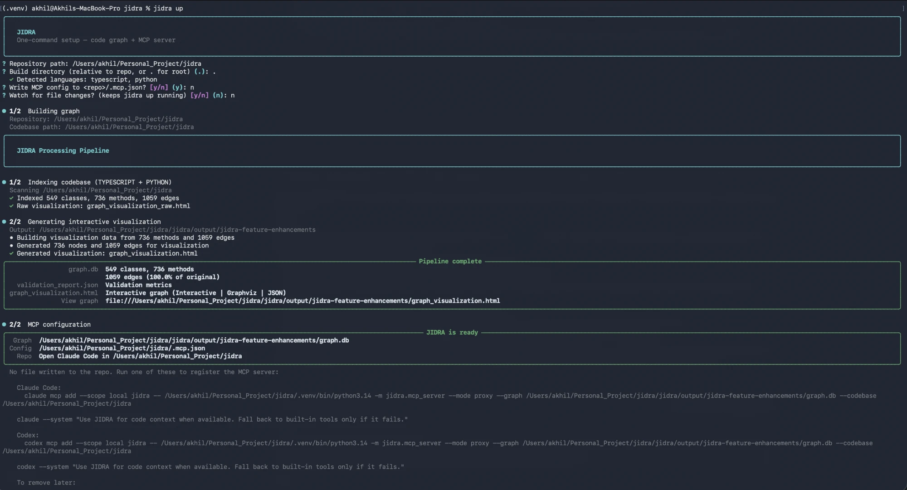
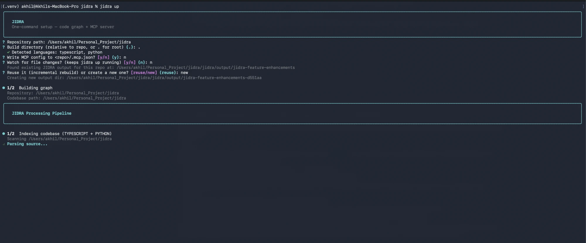
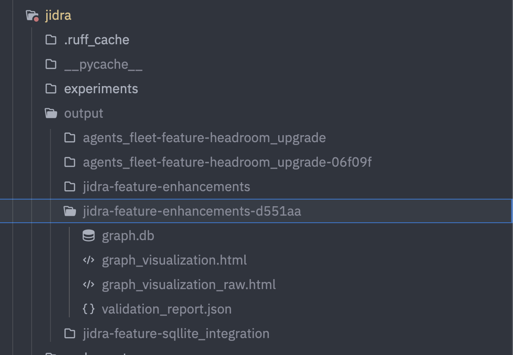
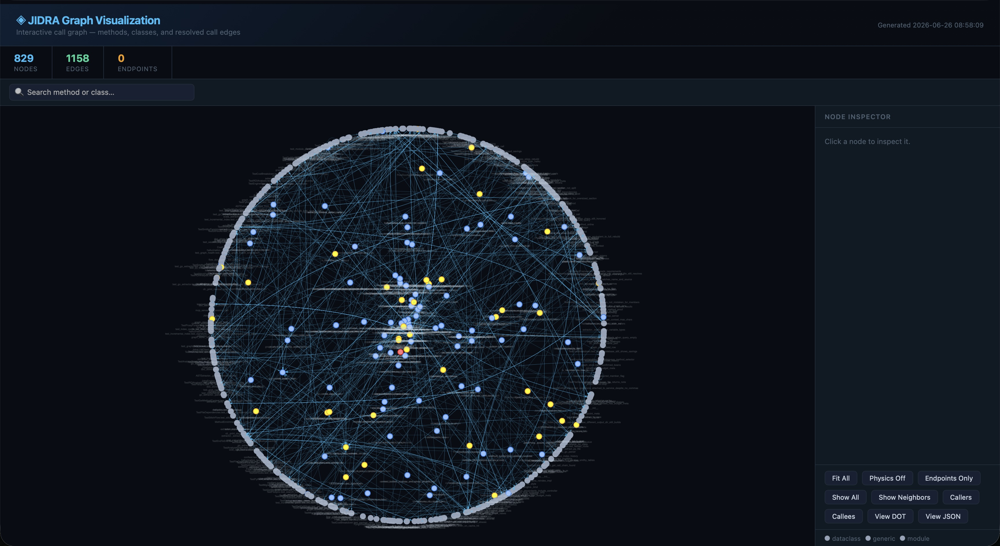
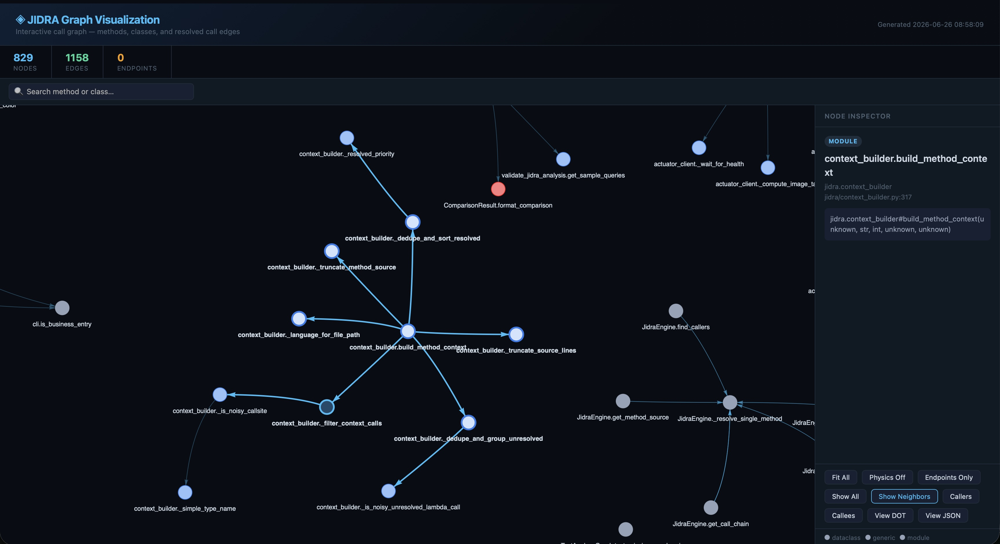
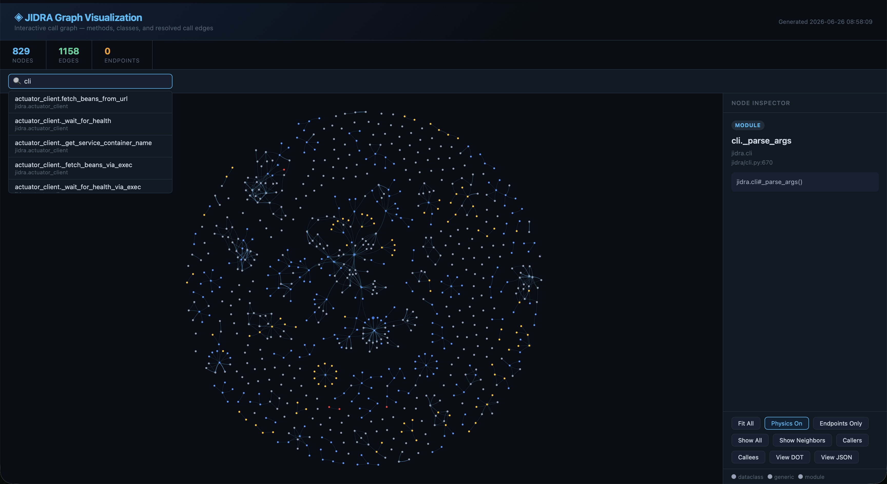
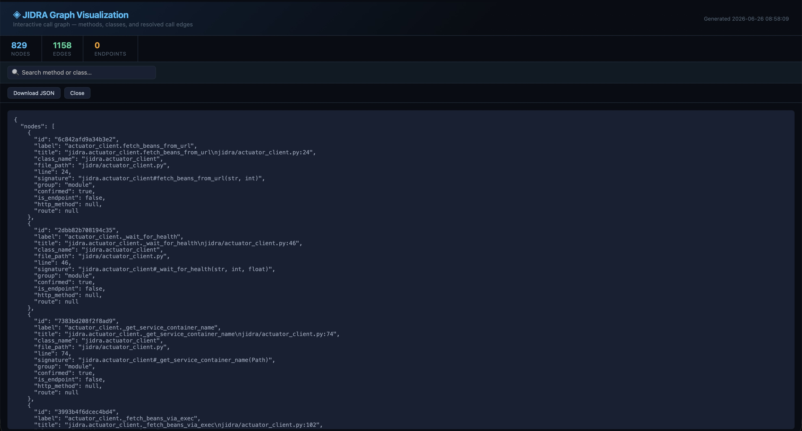
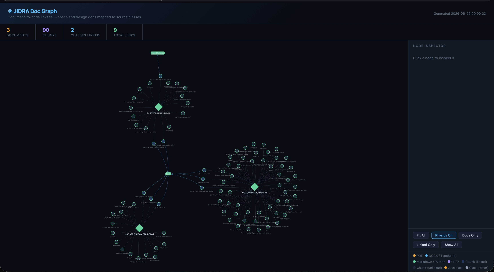
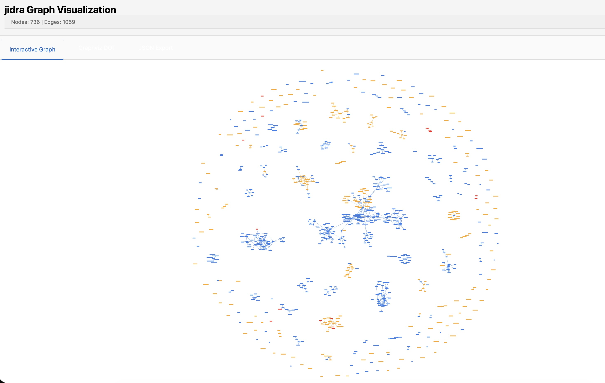
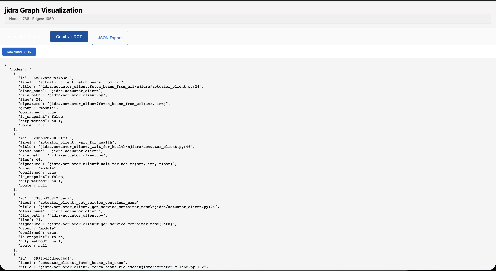

# JIDRA: Just Indexing Dependencies, Repositories, & Agents

[](https://github.com/akhilsinghcodes/jidra/actions/workflows/ci.yml)


JIDRA is a structured context backend that reduces LLM input tokens by **68-95%** for code-native queries by giving Claude a pre-analyzed call graph instead of raw source files. Multi-language support: **Scala** (~90% resolution), **Java** (~85% resolution), **TypeScript** (~80% resolution), **Python** (~68.5% resolution), **Go** (tree-sitter-based, best-effort resolution).

#### Language Supported Currently: Java/Scala/TypeScript/Python/Go

### What This Means

Real Claude Code sessions, same question, same model (claude-sonnet-4-6 1M):

```
Without JIDRA:  833,782 input tokens  ($0.2298)  — Claude read files manually
With JIDRA:     227,095 input tokens  ($0.2275)  — Claude used graph tools
Reduction:          72.8% fewer input tokens, same answer quality

At Opus pricing ($15/M input):
Without JIDRA:  $12.51/query
With JIDRA:      $3.41/query
Savings:         $9.10/query  →  $4,550/year at 500 queries
```

JIDRA connects to Claude Code as an MCP server — one command to set up:

This project is intentionally focused and graph-driven.

## Pitch (TL;DR)

- **Multi-language** → Scala, Java, TypeScript, Python, Go (auto-detected)
- **Index once** → Get a deterministic call graph (AST-based, language-optimized)
- **Reduce noise** → Remove phantom edges (Java: runtime validation, TS/Python/Scala/Go: static analysis)
- **Generate context** → 68-95% smaller prompt-ready context for Claude/Codex/Gemini
- **Trace execution** → See likely business flow with uncertainty markers
- **Reduce LLM cost** → Proven token reduction on code-native workflows (measured on real projects)
- **Ship agents & skills** → `jidra init` installs a Haiku subagent + two slash commands into your repo's `.claude/` — blast radius analysis and code navigation, no manual setup

**Real Proof — Claude Code sessions, same question, same model (claude-sonnet-4-6):**

| Session | Input tokens | Output tokens | Cost |
|---------|-------------|---------------|------|
| Without JIDRA (filesystem tools only) | 833,782 | 5,161 | $0.2298 |
| With JIDRA (MCP graph tools) | 227,095 | 1,784 | $0.2275 |
| **Reduction** | **72.8%** | **65.4%** | **~same** |

Same cost today at Sonnet pricing because output tokens dominate — but 606k fewer input tokens per query. At Opus pricing ($15/M input vs $3/M) that gap is $9.09 saved per query.

## Screenshots

`jidra up` is the one-command setup flow — prompts, a live spinner while parsing, and a styled summary panel when it's done:

<p align="center">
  
</p>

Live progress while indexing is in flight:

<p align="center">
  
</p>

`jidra up` writes its output (graph + visualization) under `jidra/output/<repo-slug>-<branch>/`, never into the target repo:

<p align="center">
  
</p>

The generated `graph_visualization.html` — interactive graph, Graphviz DOT, and JSON export tabs:

<p align="center">
  
</p>

Click any node to inspect its module, signature, and file location; "Show Neighbors" highlights its direct call relationships:

<p align="center">
  
</p>

Search by method or class name to jump straight to a node:

<p align="center">
  
</p>

The same view also exports the full graph as Graphviz DOT or pretty-printed JSON, in-place:

<p align="center">
  
</p>

`jidra up` also offers to index your `docs/`/`README.md` and link doc chunks to the classes/methods they describe — rendered as its own interactive doc graph:

<p align="center">
  
</p>

Every index, reindex, and doc-index run is recorded to a local telemetry dashboard (`jidra history --html`, served from `~/.jidra/telemetry/telemetry.html`):

<p align="center">
  
  
</p>

## What JIDRA Does

- **Indexes** Scala, Java, TypeScript, Python, and Go source into deterministic call graphs
- **Validates** with language-specific strategies (Spring Actuator for Java, compiler-resolved for Scala, static analysis for TS/Python/Go)
- **Searches** the graph by keyword or natural language (FTS5-backed `jidra_search` / `jidra_explore`)
- **Surfaces** framework structure as first-class data — HTTP endpoints, React/Vue/Angular components & hooks (`jidra_get_endpoints`, `jidra_get_components`, `jidra_get_framework_summary`)
- **Answers** impact-analysis questions — what breaks if I change this file (`jidra_get_file_dependents` / `_dependencies`)
- **Resolves** interface→implementation and class surface — list every concrete implementation of an interface/abstract class in one call (`jidra_get_implementations`), or every method and field of a class (`jidra_get_class_members`)
- **Generates** noise-free context (68-95% smaller depending on language), auto-scaled to repo size (budget tiers)
- **Traces** method/function execution with uncertainty markers
- **Stays fresh** automatically via git hooks + an in-daemon file watcher (no manual reindex)
- **Exports** as JSON, MCP tools, or interactive HTML
- **Integrates** with Claude/Codex/Gemini via MCP (shared-daemon proxy mode shares one in-memory graph across editor windows)
- **Reduces** LLM token costs by 68-95% (proven on real projects)

## Benchmarked vs CodeGraph (agent-in-loop)

JIDRA was evaluated against the [CodeGraph](https://github.com/colbymchenry/codegraph) MCP server using a real coding agent (Haiku 4.5): the same LLM was given a navigation task and **exactly one backend's tools**, then scored on correctness, tool calls, tokens, and hallucinations. Three languages evaluated.

### Enterprise Java (Spring Boot monorepo, ~18,700 methods, 8 tasks) — v25

| Backend | correct | avg tool calls | avg tokens | total cost | halluc. |
|---|---|---|---|---|---|
| **JIDRA** (+ tool selection skill) | **8/8** | **1.4** | **12.7k** | **$0.091** | 0/8 |
| CodeGraph | 7/8 | 2.2 | 32.3k | $0.220 | 3/8 |

**2.5× token ratio.** JIDRA 8/8, zero hallucinations. CodeGraph permanently fails T1 (can't count implementations exactly — blast-radius design gap) and produces 3 hallucinated symbols. Ghost-method task T4: JIDRA 1c/7.8k vs CG 4c/77.6k (10×) — `get_method_source` returns a typed `method_not_found_on_class` error in one call; CG burns 4 calls before concluding absent. Tool selection skill routes existence checks → `get_implementations`, method existence → `get_method_source`, behavioral search → `jidra_explore`.

### Public Java (Spring Boot monorepo, ~1,200 methods, 8 tasks)

| Backend | correct | avg tool calls | avg tokens | total cost | halluc. |
|---|---|---|---|---|---|
| **JIDRA** (+ tool selection skill) | **8/8** | **1.6** | **18.4k** | **$0.131** | 0/8 |
| CodeGraph | 7/8 | 2.4 | 36.6k | $0.248 | 0/8 |

**2.0× token ratio.** JIDRA 8/8; CodeGraph permanently fails T1 (can't produce exact implementation counts — blast-radius design gap). T4 standout: JIDRA 2c/8k vs CG 5c/108k (13×). T1/T3 avg pulled up by stochastic `limit=100`/`depth=10` parameter over-reach; stripping those two outliers: ~12.8k avg, ~4–5× ratio. Tool selection skill (decision table + few-shot ✓/✗ examples) routes existence checks → `get_implementations`, method existence → `get_method_source`, behavioral search → `jidra_explore`. Full per-task data: [docs/archive/FINDINGS_jidra_vs_codegraph_v18.md](docs/archive/FINDINGS_jidra_vs_codegraph_v18.md).

### Python (jidra repo, ~2,100 methods, 6 tasks) — v13

| Backend | correct | avg tool calls | avg tokens | total cost | halluc. |
|---|---|---|---|---|---|
| **JIDRA** (+ tool selection skill) | **6/6** | **1.8** | **18.8k** | **$0.100** | 0/6 |
| CodeGraph | 3/6 | 4.5 | 152.2k | $0.748 | 7/6 |

**8.1× token ratio.** JIDRA 6/6, zero hallucinations. CodeGraph fails 3 tasks outright and hallucinates symbols in 7 of 6 runs (multiple per run). PY4 (definition lookup in a 1,200-line file): CG hit max iters at 14 calls / 617k tokens without answering; JIDRA: 2 calls / 14.6k. Ghost-function PY3: JIDRA 3c/32k (returns absent in final call); CG 3c/51k with 1 hallucinated symbol.

### TypeScript (MTKruto, ~630 methods, 5 tasks) — v10

| Backend | correct | avg tool calls | avg tokens | total cost | halluc. |
|---|---|---|---|---|---|
| **JIDRA** (+ tool selection skill) | **5/5** | **2.0** | **15.0k** | **$0.069** | 0/5 |
| CodeGraph | 3/5 | 8.4 | 276.9k | $1.128 | 1/5 |

**18.4× token ratio.** JIDRA 5/5, zero hallucinations. CodeGraph fails 2 tasks (TS4/TS5: hits 14 max-iters without answering — can't fetch a single method from a large file by name). TS2 call-graph trace: JIDRA 3c/17.5k vs CG 9c/308.8k (17.6×).

### Cross-language summary (latest runs)

| language | JIDRA | CG | token ratio | JIDRA halluc | CG halluc | JIDRA cost | CG cost |
|---|---|---|---|---|---|---|---|
| Java (v25) | **8/8** | 7/8 | **2.5×** | 0 | 3 | $0.091 | $0.220 |
| Python (v13) | **6/6** | 3/6 | **8.1×** | 0 | 7 | $0.100 | $0.748 |
| TypeScript (v10) | **5/5** | 3/5 | **18.4×** | 0 | 1 | $0.069 | $1.128 |

Full methodology and per-task data: [FINDINGS_jidra_vs_codegraph.md](FINDINGS_jidra_vs_codegraph.md).

Root cause in all three languages: `codegraph_explore` cannot walk reverse call edges, extract a single named method from a large file, or count implementations with precision — so it spirals into many calls and hallucinates when it can't find the answer. JIDRA's tools answer each in 1–2 calls with typed error responses for absent symbols. JIDRA hallucination rate: 0/19 runs across all three suites. CodeGraph: 11/19 runs with at least one hallucinated symbol.

Full methodology and per-task data: [docs/archive/FINDINGS_jidra_vs_codegraph_v18.md](docs/archive/FINDINGS_jidra_vs_codegraph_v18.md).

## Benchmarked vs CodeGraph (method-level retrieval)

Separate retrieval benchmark mirroring CodeGraph's own `runner.ts` methodology (Recall@10 + MRR). Four TypeScript repos, 48 cases total, method symbols only.

| repo | methods | JIDRA passed | CG passed | JIDRA recall | CG recall |
|---|---|---|---|---|---|
| MTKruto | ~2,300 | **12/12 (100%)** | 11/12 (92%) | **0.847** | 0.764 |
| Trezor Suite | ~12,600 | **10/12 (83%)** | 8/12 (67%) | **0.708** | 0.500 |
| PostyBirb | ~2,200 | **10/12 (83%)** | 9/12 (75%) | **0.708** | 0.625 |
| Shapeshift Web | ~6,200 | **12/12 (100%)** | 7/12 (58%) | **0.792** | 0.458 |
| **Aggregate** | — | **44/48 (92%)** | **35/48 (73%)** | **0.764** | 0.587 |

When CodeGraph misses, it returns 0 results — methods exist in the repo but aren't indexed (standalone functions, React hooks, route handlers in monorepo sub-packages). JIDRA's tree-sitter extractor captures all of these. Explore gap widens in complex monorepo structures: Shapeshift 6/6 vs 3/6 because CodeGraph's traversal doesn't cross package boundaries. Full data: [JIDRA_vs_CodeGraph_retrieval_final.md](docs/JIDRA_vs_CodeGraph_retrieval_final.md).

## SWE-bench Style File Retrieval (8 repos, 279 cases)

Broader evaluation using [SWE-bench](https://www.swebench.com/) issue-to-file mapping: given a GitHub issue description, retrieve the files a human developer actually touched. Scored at file level (≥50% file recall = pass). Four-way comparison: JIDRA search, JIDRA explore, CodeGraph search, and CodeGraph explore†.

| Repo | Cases | JIDRA Search | JIDRA Explore | CG Search | CG Explore† |
|------|------:|:------------:|:-------------:|:---------:|:-----------:|
| axios | 6 | **100%** | 83% | 50% | 17% |
| preact | 17 | **94%** | **94%** | 47% | 29% |
| matplotlib | 23 | **91%** | 83% | 26% | 9% |
| django | 114 | **87%** | 74% | 31% | 16% |
| caddy | 14 | **79%** | 71% | 7% | 21% |
| sympy | 77 | **70%** | **70%** | 14% | 10% |
| docusaurus | 5 | **60%** | 40% | 20% | 0% |
| scikit-learn | 23 | **48%** | 43% | 30% | 22% |
| **Aggregate** | **279** | **~78%** | **~70%** | **~28%** | **~16%** |

† CG explore is a 1-hop edge approximation of CodeGraph's semantic exploration — not an exact equivalent of JIDRA's multi-hop graph traversal.

Key findings:
- JIDRA search beats CodeGraph search by ~50 percentage points on average across all 8 repos
- JIDRA explore (the mode used by the MCP agent) adds graph-traversal context that further improves file discovery for multi-file changes
- CodeGraph's FTS gaps are most severe in Go (caddy: 7%) and domain-heavy Python (sympy: 14%); JIDRA's tree-sitter extractor indexes standalone functions and hooks CG misses
- scikit-learn's 48% ceiling is a semantic gap: high-level math concept queries (e.g. "ridge regression convergence") have no lexical match to function names — requires embedding-based search

Per-repo detailed reports: [docs/evals/](docs/evals/)
Consolidated analysis: [docs/FINDINGS_PYTHON.md](docs/FINDINGS_PYTHON.md) · [docs/FINDINGS_TYPESCRIPT.md](docs/FINDINGS_TYPESCRIPT.md) · [docs/JIDRA_vs_CodeGraph_retrieval_all.md](docs/JIDRA_vs_CodeGraph_retrieval_all.md)

## What JIDRA Does NOT Do (By Design)

- ❌ **Autonomous agent loops** - Claude already does this; we provide context
- ❌ **Multi-service distributed reasoning** - Requires service mesh, not code analysis
- ❌ **Interactive debugging sessions** - Single-shot context generation (not loops)
- ❌ **Config-driven behavior analysis** - YAML/JSON parsing planned for v2.0
- ❌ **Full semantic Java correctness** - AST + Actuator validation is best-effort

**Bottom line:** JIDRA is infrastructure FOR agents, not a replacement agent.

## Project Layout

```text
jidra/
├── pyproject.toml
├── requirements.txt
├── Cargo.toml                     # workspace root for jidra-resolver
├── README.md
├── src/jidra/                     # Python package (src layout)
│   ├── cli.py
│   ├── models.py
│   ├── config.yaml
│   ├── extractors/
│   │   ├── extractor.py           # dispatcher — routes to language-specific extractor
│   │   ├── ts_extractor.py        # TypeScript (tree-sitter or Docker sidecar)
│   │   ├── ts_treesitter.py       # in-process tree-sitter TS backend (default, no Docker)
│   │   ├── go_extractor.py        # Go (tree-sitter, in-process)
│   │   ├── py_extractor.py        # Python (AST + symbol table)
│   │   ├── scala_extractor.py     # Scala (SemanticDB two-pass)
│   │   └── smithy_extractor.py    # Smithy IDL extraction
│   ├── filters/
│   │   ├── filters.py             # Java file iteration
│   │   ├── file_filters.py        # shared file-level filtering helpers
│   │   ├── ts_filters.py          # TS language detection + file iteration
│   │   ├── go_filters.py          # Go file iteration + excluded dirs
│   │   ├── py_filters.py          # Python language detection
│   │   ├── py_type_provider.py    # Python type validation (Pyright)
│   │   └── scala_filters.py       # Scala file iteration + excluded dirs
│   ├── graph/
│   │   ├── graph_store.py         # SQLite graph DB (read/write, FTS5, migrations)
│   │   ├── graph_rag.py           # retrieval-augmented graph search
│   │   ├── graph_validator.py     # Spring Actuator validation + edge filtering
│   │   └── graph_visualizer.py    # interactive HTML export
│   ├── engine/
│   │   ├── engine.py              # full index pipeline orchestrator
│   │   ├── reindexer.py           # incremental reindex (fingerprint-based)
│   │   ├── parallel.py            # parallel extraction workers
│   │   ├── ranking.py             # result ranking / budget tiers
│   │   ├── daemon.py              # shared-graph daemon (Unix socket RPC, hot-reload)
│   │   └── watcher.py             # debounced filesystem watcher → incremental reindex
│   ├── server/
│   │   ├── mcp_server.py          # MCP tool surface (primary + full tiers)
│   │   ├── proxy.py               # stdio↔socket MCP proxy (spawns daemon)
│   │   └── actuator_client.py     # Spring Actuator HTTP client
│   ├── flow/
│   │   ├── flow_stitcher.py       # deterministic flow-doc generator
│   │   └── flow_doc_agent.py      # LLM-assisted flow documentation
│   ├── indexing/
│   │   ├── doc_indexer.py         # doc/README indexer
│   │   ├── doc_store.py           # doc chunk storage
│   │   ├── doc_graph_visualizer.py
│   │   ├── resources_chunker.py
│   │   ├── resources_indexer.py
│   │   └── resources_linker.py    # links doc chunks to graph nodes
│   ├── llm/
│   │   ├── llm_client.py          # LiteLLM provider wrapper
│   │   ├── trace_engine.py        # method execution trace + uncertainty markers
│   │   ├── cost_calculator.py     # token/cost measurement
│   │   └── telemetry.py           # run history + telemetry dashboard
│   ├── utils/
│   │   ├── context_builder.py     # prompt-ready context assembly
│   │   ├── selector.py            # method selector resolution
│   │   ├── git_hooks.py           # post-commit/merge/checkout hook installer
│   │   ├── cache.py
│   │   ├── parser.py
│   │   └── ui.py                  # CLI rich output helpers
│   ├── smithy/
│   │   ├── smithy_bridge.py       # Smithy → graph bridge
│   │   └── smithy4j_builder.py
│   ├── ui/                        # Flask API server (serves the React UI)
│   │   ├── app.py
│   │   └── routes/
│   │       ├── graph_routes.py
│   │       ├── index_routes.py
│   │       ├── explore_routes.py
│   │       ├── docs_routes.py
│   │       ├── history_routes.py
│   │       ├── mcp_routes.py
│   │       ├── sql_routes.py
│   │       └── util_routes.py
│   └── claude_install/            # files shipped into .claude/ by `jidra init`
│       ├── agents/                # jidra-investigator agent definition
│       └── skills/                # jidra-navigate + jidra-blast-radius skills
├── jidra-resolver/                # Rust extension (PyO3/maturin) — fast call resolution
│   ├── Cargo.toml
│   ├── pyproject.toml
│   └── src/
│       ├── lib.rs
│       ├── resolver.rs
│       ├── lookup.rs
│       ├── store.rs
│       ├── models.rs
│       └── normalize.rs
├── ui/                            # React frontend (Vite + Tailwind)
│   ├── index.html
│   ├── vite.config.ts
│   └── src/
│       ├── App.tsx
│       ├── components/            # GraphViewer, IndexPanel, ExplorePanel, GraphStatusPanel, …
│       ├── hooks/useRepo.ts
│       ├── lib/api.ts             # typed fetch client
│       └── styles/
├── sidecar/
│   ├── scala/                     # JDK + sbt Docker sidecar (SemanticDB export)
│   │   ├── src/Dockerfile
│   │   ├── src/entrypoint.sh
│   │   └── proto/semanticdb.proto + semanticdb_pb2.py
│   └── typescript/                # ts-morph Docker sidecar (optional high-res TS backend)
│       ├── Dockerfile
│       └── index.js
├── tests/                         # pytest suite
├── validations/                   # token-saving + hallucination benchmarks
├── evals/                         # agent-in-loop eval harness + datasets
├── experiments/                   # one-off research scripts (not shipped)
├── scripts/                       # contract validation helpers
└── docs/                          # MCP reference, findings, architecture notes
```

## Installation

This project is released under the MIT License (see `LICENSE`).

From project root:

```bash
cd scripts/jidra
pip install -e .
```

If you use the local venv:

```bash
./venv/bin/pip install -e .
```

Also installable via `uvx jidra init` without a global install (`pyproject.toml` uses standard `[project.scripts]`).

## `jidra init` — per-repo setup

Run once per repo. Idempotent — re-running on an existing `.jidra/` does incremental reindex unless `--force`.

```bash
jidra init [--codebase PATH] [--force]
```

What it does:

1. Prompts for skip folders (comma-separated, optional)
2. Prompts for git hooks install (y/n)
3. For Java repos: prompts for actuator URL + Docker (removes phantom edges via live bean validation)
4. Builds graph → `<repo>/.jidra/graph.db`
5. Writes `<repo>/.mcp.json` with explicit `--graph` and `--codebase` paths
6. Installs **agent + skills** into `<repo>/.claude/` (see [Agents & Skills](#agents--skills) below)
7. Installs git hooks if confirmed

Output layout:

```
<repo>/
  .jidra/
    graph.db                      # code graph (165MB typical Java repo)
    .java_code_intel_cache.json   # Spring bean cache
    graph_visualization.html      # optional
    validation_report.json
  .mcp.json                       # MCP server config (explicit paths)
  .claude/
    agents/
      jidra-investigator.md
    skills/
      jidra-navigate/SKILL.md
      jidra-blast-radius/SKILL.md
```

`.mcp.json` is written with explicit `--graph` and `--codebase` paths. Using `jidra serve --mcp` without `--graph` relies on cwd discovery, which fails when Claude Code launches MCP servers from a different working directory. Explicit paths are the only reliable approach.

> **What does NOT get committed** (user's responsibility): add `.jidra/`, `.mcp.json`, and `.claude/` to `.gitignore` or commit selectively. `jidra init` does not touch `.gitignore`.

## Agents & Skills

`jidra init` ships three files into `.claude/`:

### `jidra-investigator` (agent)

Read-only code locator running on **Haiku** (`mcpServers: [jidra]`). Never edits. Never proposes fixes. Returns a `file:line` table.

Tool selection (decision table — shipped in `jidra_tool_selection.md`):

| Question type | Tool |
|---|---|
| Does class/interface X exist? | `jidra_get_implementations("X")` → typed `interface_class_not_found` |
| Does method X exist on class Y? | `jidra_get_method_source("Class#method")` → typed `method_not_found_on_class` |
| Known identifier, want location | `jidra_search("Name", exact=True)` — top-5 BM25, no fan-out |
| Behavioral / "which of N impls matches X?" | `jidra_explore("description")` — semantic ranking over full graph |
| Who calls method X? | `jidra_find_callers("X")` |
| What does method X call? | `jidra_get_agent_flow("X")` |
| Stack trace → locations | `jidra_analyze_stack_trace` |

Read/Grep only if JIDRA returns nothing.

### `/jidra-navigate` (skill)

Triggers on: *"who calls", "what calls", "find callers", "trace flow", "what implements", "does X exist"*

Spawns `jidra-investigator` with the user's full query. Returns `file:line` table with symbol and context column.

### `/jidra-blast-radius` (skill)

Triggers on: *"blast radius", "impact of changing", "what breaks if", "who is affected by", "safe to change"*

Protocol:
1. `jidra_find_callers` depth=2
2. If caller_count > 10 at depth 1, drills top 3 callers deeper
3. Returns direct callers table + indirect callers table with chain path
4. Flags HTTP endpoints, scheduled jobs, public API in chain
5. Risk summary: **LOW / MEDIUM / HIGH**

**Example — DeviceController.saveDevice blast radius:**

Direct callers (depth 1) — 13 sites across every major search flow. Indirect callers flagged a `DeviceController#getTenantDevices` HTTP endpoint and a `DeviceController#getTenantDevices` scheduled job. Risk: **HIGH**.

**Token cost comparison (same query, 4 approaches):**

| Approach | Agent | in tokens | out tokens | cost |
|---|---|---|---|---|
| No JIDRA (grep) | cavecrew-investigator | 188,836 | 514 | $0.161 |
| No slash cmd (main session + redundant agent) | jidra-investigator (wasted) | 276,588 | 905 | ~$0.056 |
| Explicit `/jidra-blast-radius` | jidra-investigator | 142,219 | 1,337 | $0.182 |
| Natural language (auto-triggered skill) | jidra-investigator | 189,736 | 1,133 | $0.217 |

Key observations:
- Grep missed depth-2 chain entirely — no HTTP endpoint flag, no risk rating
- Explicit slash command most efficient (142k in) — clean delegation path
- Natural language auto-trigger slightly more expensive (main session reasoning overhead) but better UX
- Both JIDRA approaches returned correct blast radius with HTTP endpoint and scheduled job flagged

**Design note:** Skills are the trigger mechanism — agent `description` alone is not reliable, as the main session (Sonnet/Opus) will handle queries itself if it has jidra tools. Skills force explicit delegation to Haiku.

## Quick Start

### Optional: configure your project package prefixes

Some features (like `error-doc` choosing the first "project" stack frame as an anchor) can use
package prefixes to distinguish your code from third-party libraries.

Set a comma-separated list:


# Clone repository
git clone https://github.com/akhilsinghcodes/jidra.git
cd jidra

If unset, JIDRA treats any package as project code for anchoring.

### 1) Build graph

```bash
python -m jidra.cli index \
  --codebase /path/to/java/repo \
  --output /tmp/graph.db
```

When output is a directory, JIDRA writes a single `graph.db` SQLite file. Main and test source are kept as separate rows via a `variant` column (`main` / `test` / `validated`) rather than separate files.

### 2) Trace method flow

```bash
python -m jidra.cli trace \
  --graph /tmp/graph.db \
  --method com.example.Controller.search
```

### 3) Build method context

```bash
python -m jidra.cli context \
  --graph /tmp/graph.db \
  --method com.example.Controller.search
```

### 4) Generate prompt text

```bash
python -m jidra.cli prompt \
  --graph /tmp/graph.db \
  --method com.example.Controller.search \
  --target codex
```

### 5) Diagnose with LLM

```bash
python -m jidra.cli diagnose \
  --graph /tmp/graph.db \
  --method com.example.Controller.search \
  --target codex \
  --llm-profile local
```

## Storage: SQLite (`graph.db`)

JIDRA persists the code graph in a single SQLite database, `graph.db`, instead of the
JSONL files (`graph.jsonl`, `graph_test.jsonl`, `graph_validated.jsonl`) used in earlier
versions. One file, three logical graphs:

- **`variant` column** (`main` / `test` / `validated`) replaces the three separate
  JSONL files — production code, test code, and the Spring-Actuator-filtered graph all
  live in the same tables, distinguished by a column instead of a filename.
- **`module_id` column** replaces per-module JSONL files + `modules_index.json` for
  multi-module repos — one `graph.db`, scoped rows, no index file to keep in sync.
- **Real incremental updates**: reindexing now runs scoped SQL `DELETE`/`INSERT`
  against just the changed `file_path` rows, instead of loading the entire graph into
  memory and rewriting the whole file on every change. Large repos reindex
  proportionally to what changed, not to total codebase size.
- **No compression step**: SQLite's on-disk format made the `--compress`/`.jsonl.zst`
  path unnecessary, so it (and the `zstandard` dependency) was removed entirely.
- **Inspectable with standard tools**: `sqlite3 graph.db ".tables"` /
  `SELECT * FROM methods WHERE variant='validated'` work directly — no custom JSONL
  parsing required to poke at the data.
- **Full-text search index**: a `methods_fts` FTS5 virtual table (kept in sync by
  triggers) backs `jidra_search` / `jidra_explore`. The `methods` table also carries a
  `framework_role` column for endpoint/component queries.
- **In-place migration**: the schema is versioned (`schema_version`); opening an older
  `2.0` database transparently upgrades it to `2.1` (creates + backfills the FTS index,
  adds `framework_role`) on first `connect()` — no rebuild required.

`jidra up` writes `graph.db` (plus the validation report and visualization HTML) to
JIDRA's own `jidra/output/<repo-slug>-<branch>/` directory rather than into the
target repo — the repo you're analyzing only ever gets a `.mcp.json` (or nothing, if
you register the MCP server via `claude mcp add` / `codex mcp add` instead).

## Graph Selection Behavior

For `trace`, `context`, `trace-route`, `prompt`, `diagnose`:

- `--graph` provided: used directly
- `--graph` omitted: selected by `--graph-type` (`main` default)
  - `main` -> `jidra/output/graph.db` (`variant="main"`)
  - `test` -> `jidra/output/graph.db` (`variant="test"`)

## Method Selectors

Supported method selectors:

- method id
- full signature
- full class + method (`com.example.Class.method`)
- short class + method (`Class.method`)
- bare method name (if unique)

Ambiguous selector output includes candidate ids you can use directly.

## MCP Server

### Setup

`jidra init` writes `.mcp.json` with explicit `--graph` and `--codebase` paths. Restart Claude Code — MCP connects automatically. See [`jidra init`](#jidra-init----per-repo-setup) above.

### `jidra serve`

Alias for `jidra mcp`. Starts the MCP server manually:

```bash
jidra serve                          # default mode
jidra serve --graph /path/to/graph.db
```

### Server modes

| Mode | Behavior |
|---|---|
| `direct` (default) | Loads graph in-process. Used by `jidra mcp` / `jidra serve`. |
| `proxy` | Thin stdio↔socket bridge — spawns a shared **daemon** and forwards calls, so multiple editor windows share one in-memory graph. Degrades to `direct` on Windows / no-socket. |
| `daemon` | Detached background server (normally spawned by proxy, not run by hand). Holds graph in RAM, serves N proxies over Unix socket, hot-reloads on file changes. |

`jidra init` writes `.mcp.json` in `--mode proxy`.

### Tool surface

By default only the **primary tier** (7 high-confidence tools) is visible: `jidra_explore`, `jidra_get_method_source`, `jidra_find_callers`, `jidra_get_implementations`, `jidra_analyze_stack_trace`, `jidra_search`, `jidra_get_agent_flow`.

Set `JIDRA_FULL_TOOLS=1` to expose all 25+ tools, including lower-precision variants (`jidra_get_flow`, etc.) and grounding tools (`jidra_query_by_annotation`, `jidra_field_access`).

Full tool reference: [docs/MCP.md](docs/MCP.md).

### Budget-tiered output

Responses auto-scale to graph size. Every context/flow response includes `budget_tier` (`XS`…`XL`, keyed on method count) and `graph_size`. Pass explicit `max_chars` / `depth` / `top_n` to override tier defaults.

---

## Command Reference

## `validate`

Purpose: validate static call graph against a running Spring Boot app's actuator beans, filtering out phantom edges to uninstantiated classes.

```bash
jidra validate \
  [--graph <path>] \
  [--graph-type main|test] \
  [--actuator-url <url>] \
  [--codebase <path>] \
  [--port 8080] \
  [--timeout 120] \
  [--output <path>] \
  [--report <path>] \
  [--no-filter]
```

Behavior:
- `--actuator-url` provided: connect directly to running app (e.g., http://localhost:8080)
- `--codebase` provided: auto-build Docker image, run container, query actuator, cleanup
- Must provide one of `--actuator-url` or `--codebase`
- Fetches `/actuator/beans` to extract confirmed bean class names
- Filters graph: removes edges to non-bean classes, removes CallSites pointing to non-beans
- Upgrades unresolved CallSites where receiver type matches a confirmed bean
- Outputs: `graph.db` with `variant="validated"` rows (filtered graph) + JSON report

Filtering logic:
1. Extract confirmed bean class names from actuator response
2. Remove `ResolvedCallEdge` where callee method's class is not a confirmed bean
3. Remove `CallSite` records where all resolved_candidates point to non-beans
4. Upgrade `CallSite` with status `unresolved_receiver` if receiver type matches a bean
5. Keep all class/method nodes for context (not all classes are beans)

Example: Direct URL
```bash
jidra validate \
  --actuator-url http://localhost:8080 \
  --graph /path/to/graph.db \
  --output /path/to/output \
  --report /path/to/report.json
```

Example: Auto Docker build+run (always does clean Java build)
```bash
jidra validate \
  --codebase /path/to/java/repo \
  --graph /path/to/graph.db \
  --port 8080 \
  --timeout 120
```

jidra automatically:
1. Detects `./gradlew` or `pom.xml` (gradle or maven)
2. Runs `./gradlew clean build -x test` or `./mvnw clean package -DskipTests`
3. Builds Docker image
4. Runs container and queries actuator
5. Cleans up Docker resources

To skip the Java build (if you've already done `gradle build` manually):
```bash
jidra validate --codebase /path/to/java/repo --graph /path/to/graph.db --skip-build
```

Example: Debug mode (report removals, don't filter)
```bash
jidra validate \
  --actuator-url http://localhost:8080 \
  --graph /path/to/graph.db \
  --no-filter \
  --report /tmp/validation_debug.json
```

Report output shape:
```json
{
  "total_classes": 412,
  "confirmed_beans": 87,
  "unconfirmed_classes_sample": ["com.example.Dto", ...],
  "edges_before": 1843,
  "edges_after": 1201,
  "edges_removed": 642,
  "callsites_upgraded": 14,
  "removed_edges_sample": [
    {"caller": "...", "callee": "..."}
  ]
}
```

## `flow-doc`

Purpose: generate deterministic flow investigation markdown from indexed graph data (no LLM calls).

```bash
jidra flow-doc \
  [--graph <path>] \
  [--graph-type main|test] \
  --method <selector> \
  --output <markdown-path> \
  [--depth 4] \
  [--top-n 8] \
  [--max-subflows 8] \
  [--mind-map] \
  [--max-nodes 200] \
  [--include-details] \
  [--include-utility]
```

Behavior:
- Normal mode (no `--mind-map`): prioritized flow slices using `top_n` and `max_subflows`.
- `--mind-map` mode: recursive resolved-edge traversal using `depth + max_nodes`; it does not use `top_n/max_subflows` for traversal.
- `--include-details`: in `--mind-map` mode, appends legacy detailed expanded sections that still use prioritized slicing (`top_n/max_subflows`).
- Output is deterministic for the same graph + method + flags.

Examples:

```bash
python -m jidra.cli flow-doc \
  --method SearchController.search \
  --output flow_docs/verify_SearchController_search.md \
  --depth 10 \
  --top-n 10 \
  --max-subflows 10 \
  --show-agents
```

```bash
python -m jidra.cli flow-doc \
  --method SearchController.search \
  --output flow_docs/mindmap_SearchController_search.md \
  --mind-map \
  --depth 6 \
  --max-nodes 120
```

## `error-doc`

Purpose: generate deterministic error investigation markdown from a Java stack trace text file and indexed graph.

```bash
jidra error-doc \
  --stack-trace <stack-trace.txt> \
  --output <markdown-path> \
  [--graph <path>] \
  [--graph-type main|test] \
  [--depth 6] \
  [--max-nodes 200] \
  [--mind-map]
```

Stack frame parsing:
- Parses lines in format: `at package.Class.method(File.java:123)`.

Frame-to-method matching:
- class full name
- method name
- file name
- line in method `[start_line, end_line]`

Match semantics:
- `matched`: exactly one graph method candidate.
- `ambiguous`: multiple candidates (reported as ambiguity).
- `unmatched`: no candidate.

Anchor + focused map:
- primary failure anchor: first matched/ambiguous project frame.
- focused flow map: generated via deterministic `flow-doc` mind-map traversal around anchor.
- upstream/downstream behavior:
  - downstream-focused when anchor has meaningful downstream callees.
  - upstream-focused fallback when downstream is weak.

Examples:

```bash
python -m jidra.cli error-doc \
  --stack-trace examples/error_1.txt \
  --output flow_docs/error_doc_verify_clean.md \
  --mind-map \
  --depth 6 \
  --max-nodes 80
```

## Determinism and Limits

- Static analysis only; runtime dispatch is not guaranteed.
- Unresolved calls may remain in outputs.
- External library frames/methods may be unmatched.
- Graph quality directly affects output quality.
- No runtime correctness claims; output is investigation guidance.

## Example Output Snippet

```markdown
## Suggested Debug Locations
| priority | location | reason |
|---:|---|---|
| 1 | `com.example.app.health.HealthIndicator#doHealthCheck(Health.Builder)` | failing project frame |
| 2 | `org.opensearch.client.cluster.ClusterClient#health:360` | caller frame above failure |
| 3 | `this.client.cluster().health` | unresolved external call near failure |
```

## `index`

```bash
jidra index --codebase <path> --output <path-or-dir> [--ts-backend auto|treesitter|tsmorph]
```

Builds the graph (`graph.db`) from source code (auto-detects language):
- **Scala**: SemanticDB-based extraction (Docker sidecar) — compiler-resolved call edges, ~90% resolution
- **Java**: tree-sitter-based AST extraction + call resolution, ~85% resolution
- **TypeScript**: in-process **tree-sitter** extraction by default (no Docker), ~65% resolution. Pass `--ts-backend tsmorph` to use the Docker ts-morph sidecar instead (~80% resolution via the TypeScript compiler). `auto` (default) uses tree-sitter and falls back to the sidecar only if `tree-sitter-typescript` isn't installed.
- **Python**: libcst/AST-based extraction + symbol table type inference, ~68.5% resolution
- **Go**: tree-sitter-based AST extraction (in-process, no Docker/compiler) + local symbol-table call resolution, best-effort — no interface-satisfaction (structural typing) resolution

Language detection is automatic via manifest files (`build.sbt`, `pom.xml`, `package.json`, `pyproject.toml`, `go.mod`, etc.). Multiple languages in the same repo are detected and merged into a single graph automatically.

> **Note:** a directory that contains source files but **no manifest** (e.g. loose `.py`/`.ts` files with no `requirements.txt`/`pyproject.toml`/`package.json`) is not recognized as that language and will index to an empty graph. Add the appropriate manifest so the codebase is detected. This also affects auto-sync (below): the watcher/hooks will reindex but find nothing to extract.

## `reindex`

```bash
jidra reindex [--graph <path>] [--codebase <path>] [--changed-files <f1> <f2> ...]
```

Incrementally updates an existing `graph.db` after files change (fingerprint-based; falls
back to a full rebuild when needed). `--changed-files` is a hint used by the git hooks.
This is the command the git hooks and the in-daemon file watcher call under the hood.

## `hooks`

```bash
jidra hooks install   [--repo <path>] [--graph <path>]
jidra hooks uninstall [--repo <path>]
```

Installs `post-commit` / `post-merge` / `post-checkout` git hooks that auto-`reindex` the
graph when the working tree changes, so it never goes stale. Hook bodies are wrapped in
delimited `# BEGIN JIDRA` / `# END JIDRA` blocks, so they compose with other hook managers
(Husky, lefthook) and `uninstall` removes only JIDRA's block. When running the MCP server
in `--mode proxy`, the shared daemon also runs a debounced filesystem watcher that hot-reloads
the graph on save — so on most setups you get fresh graphs with no manual reindex at all.

## `trace`

```bash
jidra trace \
  [--graph <path>] \
  [--graph-type main|test] \
  --method <selector> \
  [--max-depth 5] \
  [--business-only] \
  [--output <file-or-dir>]
```

- `--business-only` filters support/metrics/logging from flow output
- root node is always preserved

## `context`

```bash
jidra context \
  [--graph <path>] \
  [--graph-type main|test] \
  --method <selector> \
  [--max-chars 12000] \
  [--max-tokens <int>] \
  [--business-only] \
  [--output <file-or-dir>]
```

Includes:
- method signature/source
- endpoint metadata
- resolved callee summary
- unresolved call summary

Context output is deduped/grouped for prompt readiness.

## `trace-route`

```bash
jidra trace-route \
  [--graph <path>] \
  [--graph-type main|test] \
  --route <path> \
  [--max-depth 5] \
  [--output <file-or-dir>]
```

## `prompt`

```bash
jidra prompt \
  [--graph <path>] \
  [--graph-type main|test] \
  --method <selector> \
  [--max-chars 12000] \
  [--max-tokens <int>] \
  [--business-only|--no-business-only] \
  [--target claude|codex|generic] \
  [--output <file-or-dir>]
```

Default: `--business-only` is enabled.

## `diagnose`

```bash
jidra diagnose \
  [--graph <path>] \
  [--graph-type main|test] \
  --method <selector> \
  [--target claude|codex|generic] \
  [--model <model>] \
  [--max-chars 12000] \
  [--max-tokens <int>] \
  [--business-only|--no-business-only] \
  [--llm-profile local|enterprise] \
  [--config <path-to-config.yaml>] \
  [--show-prompt] \
  [--quiet] \
  [--output <file-or-dir>]
```

Behavior:
- No `--output` + interactive TTY + not `--quiet`: ANSI-readable report
- No `--output` + non-TTY or `--quiet`: JSON printed
- With `--output`: JSON written to file
- `--show-prompt`: includes prompt text in result JSON
- `--max-chars`: controls method context/source size sent into prompt construction
- `--max-tokens`: overrides model output token limit for this run (when omitted, config profile default is used)

## Output Naming

When `--output` is a directory:

- trace: `trace_<graph_type>_<method>.json`
- trace + business-only: `trace_business_<graph_type>_<method>.json`
- context: `context_<graph_type>_<method>.json`
- context + business-only: `context_business_<graph_type>_<method>.json`
- trace-route: `trace_route_<graph_type>_<route_or_entry>.json`
- prompt: `prompt_<target>_<graph_type>_<method>.txt`
- diagnose: `diagnose_<target>_<graph_type>_<method>.json`

Names are normalized to lowercase snake-style safe parts.

## LLM Configuration

JIDRA uses `jidra/config.yaml`.

Example:

```yaml
llm:
  provider: litellm
  profile: local

  profiles:
    local:
      api_base: "http://localhost:4000"
      api_key_env: "LITELLM_PROXY_API_KEY"
      default_model: "ollama/gemma4:e4b"
      timeout_seconds: 120
      temperature: 0.2
      max_tokens: 1200

    enterprise:
      api_base: "https://your-enterprise-litellm.example.com"
      api_key_env: "ENTERPRISE_LITELLM_API_KEY"
      default_model: "gpt-4o-mini"
      timeout_seconds: 120
      temperature: 0.2
      max_tokens: 2000
```

Rules:
- Default profile comes from `llm.profile`
- CLI override: `--llm-profile`
- If `api_key_env` is set, env var is read
- Missing config falls back to safe local defaults

## Diagnose Output Shape

`diagnose` returns JSON with:

```json
{
  "method": "...",
  "analysis": "...",
  "llm": {
    "provider": "litellm",
    "profile": "local",
    "model": "...",
    "usage": {
      "input_tokens": 0,
      "output_tokens": 0,
      "total_tokens": 0,
      "reasoning_tokens": 0
    },
    "latency_seconds": 0.0,
    "limits": {
      "max_chars": 12000,
      "max_tokens": null
    }
  },
  "context_summary": {
    "business_flow_count": 0,
    "unresolved_count": 0
  }
}
```

If provider usage is unavailable, token counts are estimated and:

```json
"estimated": true
```

is added under `llm.usage`.

## Context/Token Limits

- `--max-chars` (context, prompt, diagnose):
  - default `12000`
  - passed directly to context building to constrain context payload size
- `--max-tokens` (context, prompt, diagnose):
  - optional CLI override
  - primarily used by `diagnose` to cap LLM output tokens
  - if omitted, profile default from `jidra/config.yaml` is used

## Troubleshooting

## `jidra --help` works but diagnose fails

Likely LLM connectivity issue:
- verify LiteLLM endpoint in config
- verify API key/env key
- verify network access to endpoint

## `No methods matched selector`

Use a stronger selector:
- class+method or exact method id from ambiguity output

## `no_flow_root:/route`

No endpoint matched that route in graph. Validate route annotations and graph source set.

## `pip install -e .` fails

Check Python/venv and package index/network availability.

## Cost/ROI Calculator

JIDRA includes a cost calculator that measures actual token savings from your real codebase — not estimates.

```bash
# Graph-wide averages
jidra cost-roi --model claude-opus-4-7 --queries 1000

# Specific method — reads real source files, no API calls
jidra cost-roi --method SearchController.search --model claude-opus-4-7 --queries 1000

# Specific method — real Claude API calls, exact token counts (requires ANTHROPIC_API_KEY)
jidra cost-roi \
  --method SearchController.search \
  --codebase /path/to/java-repo \
  --model claude-opus-4-7 \
  --queries 1000 \
  --offline false
```

See [COST_ROI_CALCULATOR.md](COST_ROI_CALCULATOR.md) for full usage and how the measurement works.

## Validation

Two scripts in `validations/` let you prove JIDRA's value on your own codebase.

### Token & Cost Validation (`run_validation.py`)

Measures real token savings via Claude API calls — traditional raw source vs JIDRA context.

```bash
ANTHROPIC_API_KEY=... python validations/run_validation.py \
    --graph /path/to/.jidra/graph.db \
    --codebase /path/to/your-repo \
    --methods "OrderController.createOrder,PaymentService.charge" \
    --model claude-opus-4-7 \
    --output validations/results.json
```

### Hallucination & Consistency Validation (`hallucination_test.py`)

Tests whether JIDRA reduces hallucinations and model drift across 5 dimensions:
1. **Call graph accuracy** — does the model correctly name what a method calls?
2. **Caller tracing** — does the model correctly name what calls a method?
3. **Change impact** — does the model correctly identify what breaks if a method changes?
4. **Unit test generation** — do generated tests reference real symbols?
5. **Consistency/drift** — does the model give the same answer twice in separate sessions?

```bash
# Pass your own methods inline
ANTHROPIC_API_KEY=... python validations/hallucination_test.py \
    --graph /path/to/.jidra/graph.db \
    --codebase /path/to/your-repo \
    --methods "OrderController.createOrder,PaymentService.charge"

# Pass methods via file (one per line)
ANTHROPIC_API_KEY=... python validations/hallucination_test.py \
    --graph /path/to/.jidra/graph.db \
    --codebase /path/to/your-repo \
    --methods-file my_methods.txt

# Auto-discover endpoints from the graph
ANTHROPIC_API_KEY=... python validations/hallucination_test.py \
    --graph /path/to/.jidra/graph.db \
    --codebase /path/to/your-repo \
    --auto-discover --discover-limit 5

# Run specific tests only (e.g. unit test gen + drift)
    --tests 4,5
```

Methods file format (`my_methods.txt`):
```
# One selector per line — ClassName.methodName or fully qualified
OrderController.createOrder
PaymentService.charge
com.example.search.SearchController.search
```

Aggregate output:
```
hallucination_rate    traditional=0.42  jidra=0.08  improvement=+81.0%
fabrication_rate      traditional=0.35  jidra=0.06  improvement=+82.9%
drift_score           traditional=0.28  jidra=0.04  improvement=+85.7%
```

## Testing

```bash
# All tests
python -m pytest tests/ -v

# Cost calculator only
python -m pytest tests/test_cost_calculator.py -v

# Unit tests only (no graph file needed)
python -m pytest tests/test_cost_calculator.py -v -k "not real and not missing"
```

See [tests/README.md](tests/README.md) for the full test structure.

## Development Notes

- `cli.py` handles command orchestration only.
- `llm_client.py` owns provider/config/use-metrics behavior.
- graph extraction and graph format are intentionally unchanged.
